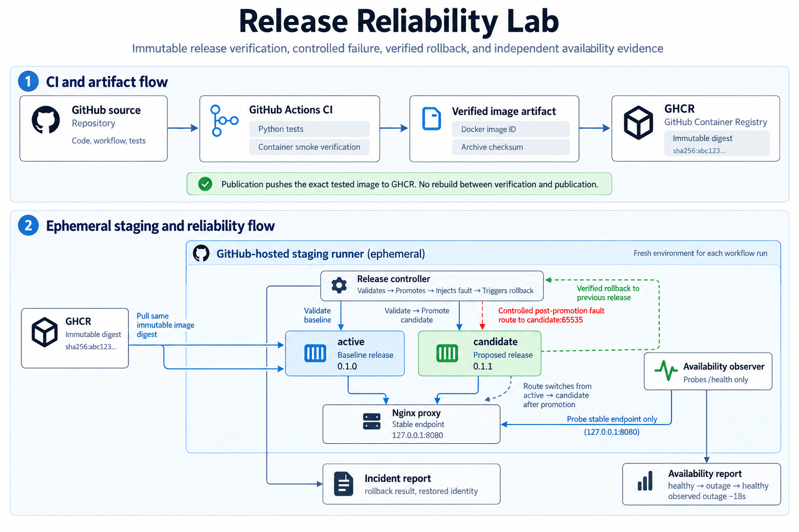
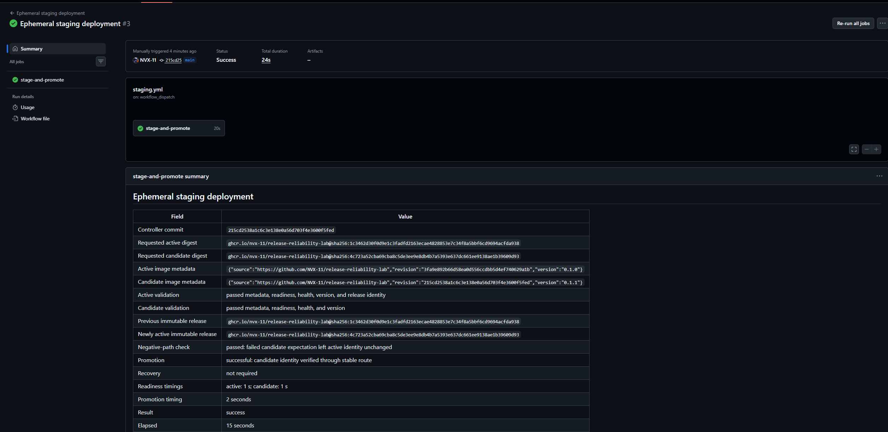
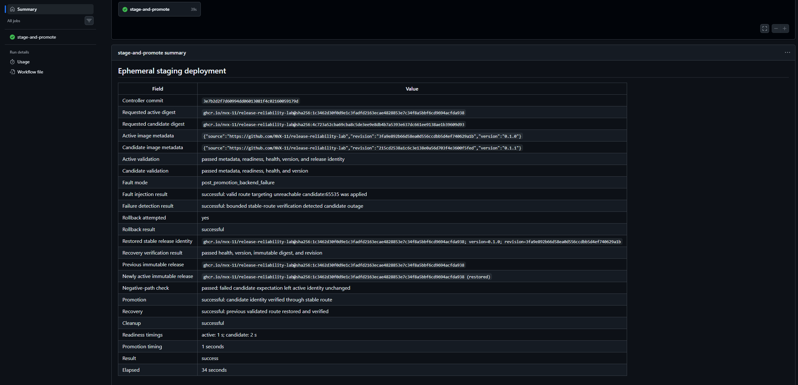
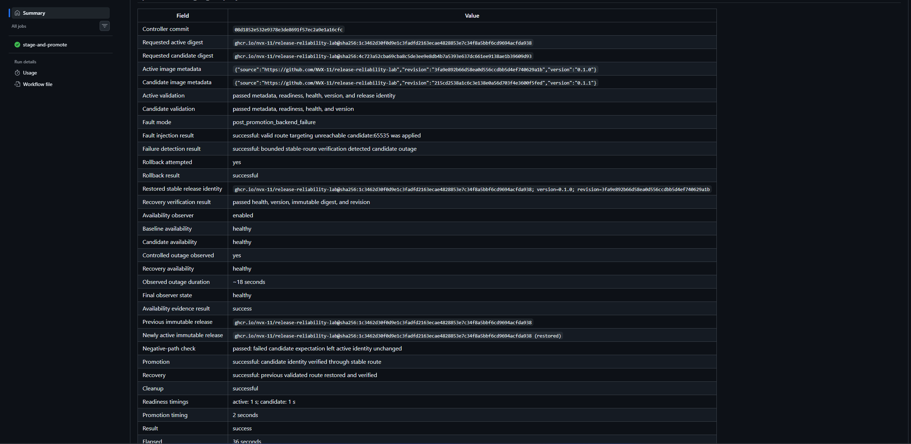

# Release Reliability Lab

A passing build does not tell you whether a release will serve traffic correctly—or whether you can recover when it stops.

This project follows a small FastAPI service from tested container to immutable release, validates it behind a stable Nginx endpoint, and exercises automatic rollback after a controlled failure. The application exists to give the release process something concrete to run and verify.

**Release flow:** test and smoke-check → publish the exact tested image → stage by digest → validate candidate → promote → inject a controlled fault → verify rollback.

<p align="center">
  
</p>

## What this proves

- The image published to GHCR is the same image that passed the container smoke test; publication does not rebuild it.
- A candidate is validated before the stable route changes, and a deliberately invalid candidate expectation leaves the baseline identity unchanged.
- A distinct release was promoted from **0.1.0 to 0.1.1**, then a controlled post-promotion failure restored the previously validated release and re-verified health, version, digest, and source revision.
- An independent observer saw **healthy baseline → healthy promoted candidate → outage → healthy recovery**, with an observed outage of **approximately 18 seconds** in the final experiment.

Staging exists only for the lifetime of a temporary GitHub-hosted runner job.

## Evidence

| Proof | Result | Run |
| --- | --- | --- |
| Verified promotion | Baseline 0.1.0 replaced by candidate 0.1.1 through the stable route | [Promotion run](https://github.com/NVX-11/release-reliability-lab/actions/runs/34762422874) |
| Controlled failure and rollback | Post-promotion failure detected; previous release restored and verified | [Rollback run](https://github.com/NVX-11/release-reliability-lab/actions/runs/34851202507) |
| Independent availability evidence | Healthy baseline and promoted service, observed outage, then healthy recovery | [Availability run](https://github.com/NVX-11/release-reliability-lab/actions/runs/34856368502) |

Fault runs produce a machine-readable incident report; observer-enabled runs also produce an independent availability report. The ~18 second outage belongs to this experiment and is a sampled observation, not a recovery-time guarantee.

### Proof snapshots

#### Verified promotion — 0.1.0 → 0.1.1

<p align="center">
  
</p>

#### Controlled failure and verified rollback

<p align="center">
  
</p>

#### Independent outage and recovery evidence

<p align="center">
  
</p>

## Architecture

### CI and artifact flow

**Source → Python tests + live container smoke verification → exact tested image → GHCR immutable digest**

The test and container jobs run independently. The container job builds once, verifies live `/health` and `/version` responses, then exports that exact image with its Docker image ID and archive checksum. Publication checks both before pushing; it never rebuilds the image.

Publication runs only on successful pushes to `main`. Each release is traceable by full-commit tag and deployed by immutable GHCR digest:

```text
ghcr.io/nvx-11/release-reliability-lab@sha256:<64-lowercase-hex-characters>
```

OCI labels record the source repository, source revision, and application version.

### Staging and reliability flow

**Immutable baseline + candidate → active/candidate containers → stable Nginx route → promotion → controlled fault → verified rollback**

| Component | Responsibility |
| --- | --- |
| Release controller | Validate image identity, health/version, promotion, rollback, and recovery |
| `active` | Run the validated baseline and remain available as the rollback target |
| `candidate` | Run the proposed release for pre-promotion validation |
| Nginx `proxy` | Expose `127.0.0.1:8080` and route the stable endpoint to the selected backend |
| Availability observer | Independently sample only `http://127.0.0.1:8080/health` |

The application containers publish no host ports. Nginx is the only host-facing component and binds only to loopback. Promotion changes the selected backend from `active:8000` to `candidate:8000`; the baseline remains running so rollback can restore it without rebuilding or republishing anything.

The observer is evidence-only. It does not inspect image metadata or decide promotion, rollback, or recovery.

### Release identity

Application version alone is not enough to identify a release. Before either image is used, the controller validates its immutable `RepoDigests` identity and OCI source, revision, and version labels.

Nginx supplies validated `X-Release-Digest` and `X-Release-Revision` headers. Stable-route verification requires the expected HTTP response, health/version payload, digest, and revision. The deployment controller commit is recorded separately from each application image's source revision.

## Availability evidence

| Evidence source | Question answered |
| --- | --- |
| Controller incident report | What failed, what rollback action was taken, and was the expected previous release restored? |
| Independent availability report | Did requests through the stable endpoint actually observe health, an outage, and later recovery? |

The dependency-free observer probes only the stable `/health` endpoint every second with a 0.5-second timeout. It classifies its own HTTP observations independently of the controller. Missing observer evidence never prevents rollback; it can only make the evidence experiment fail after controller recovery has been attempted.

## Run the staging exercise

Use **Actions → Ephemeral staging deployment → Run workflow** from reviewed `main`.

| Input | Value |
| --- | --- |
| `candidate_image` | Published image digest or full immutable GHCR reference |
| `baseline_image` | Known-good immutable release |
| `fault_mode` | `none` or `post_promotion_backend_failure` |
| `availability_observer` | `disabled` by default; enable it for the full outage/recovery evidence run |

Use distinct published releases to prove a version transition. Staging only pulls existing images; it does not build, retag, or publish them.

## CI, packaging, and permissions

The application image uses digest-pinned `python:3.12-slim-bookworm`, hash-locked runtime dependencies from `requirements.lock`, and an unprivileged runtime user. The staging Nginx image is also pinned by digest.

| Workflow job | Explicit token permissions | Registry access |
| --- | --- | --- |
| Python tests | `contents: read` | None |
| Container verification | `contents: read` | None |
| Main-branch publication | `contents: read`, `packages: write` | Push verified image |
| Manual staging | `contents: read`, `packages: read` | Pull published images |

Registry authentication uses the repository-provided `GITHUB_TOKEN`. Pull-request CI does not publish releases.

## Local development

Python 3.12 is the supported development version.

```bash
python3.12 -m venv .venv
source .venv/bin/activate
python -m pip install --upgrade pip
python -m pip install -e '.[dev]'
python -m pytest
uvicorn app.main:app --reload
```

The FastAPI service exposes health/version metadata and a small task CRUD API used as the workload for release testing.

## Scope and limitations

- **Temporary environment.** Staging exists only for one GitHub-hosted runner job. There is no permanent hosting or public endpoint.
- **Controlled failure coverage.** The proof exercises an unreachable backend route after promotion; it does not cover every application, network, or host failure.
- **Bounded availability evidence.** The observer watches one loopback health endpoint on the same runner. It is not an off-host probe or production observability system.
- **No continuous operations stack.** There is no Prometheus/Grafana stack, alerting, on-call integration, or ongoing recovery service after the workflow ends.
- **Process-local data.** Active and candidate use separate in-memory task stores. Rollback does not prove data recovery or migration safety.
- **No cloud infrastructure layer.** The repository contains no Kubernetes, Terraform, or provisioned cloud infrastructure.

## Code map

| Path | Contents |
| --- | --- |
| `app/` | FastAPI service and in-memory task workload |
| `tests/` | Application, controller, and observer tests |
| `.github/workflows/ci.yml` | Tests, container verification, and exact-image publication |
| `.github/workflows/staging.yml` | Manual staging, evidence uploads, and cleanup |
| `staging/` | Compose topology, release controller, rollback logic, observer, and cleanup |
| `Dockerfile`, `requirements.lock` | Runtime packaging and locked dependencies |
